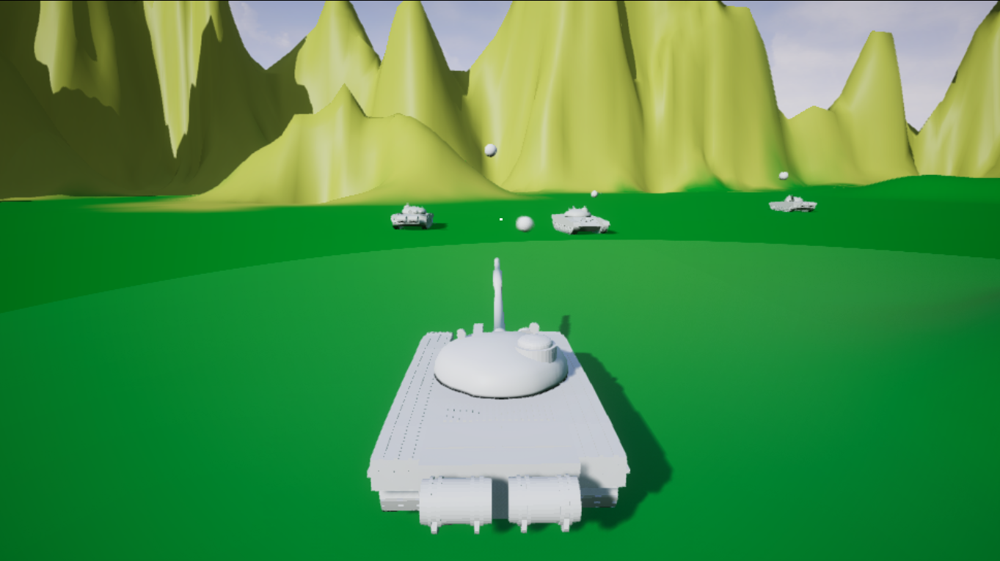

# BattleTank
An open world head to head tank battle.
This is a project to practise my Unreal Engine 4 development along with udemy course.

There is one player tank and AI tanks which defeat each other.

This project is written in C++ and some Blueprint is used.

Project covers some basics to learn UE4.

